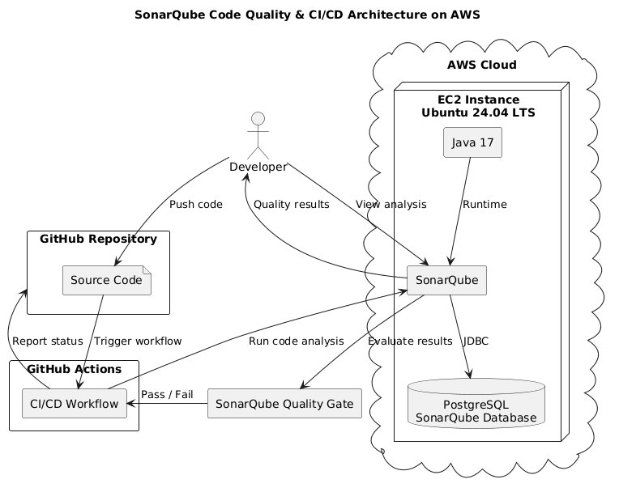
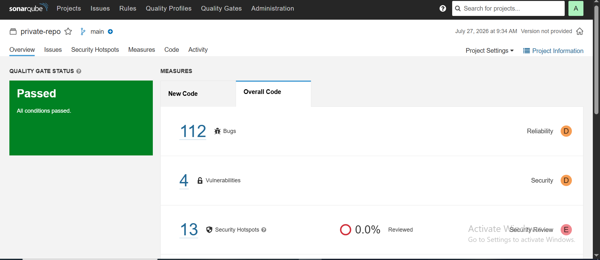
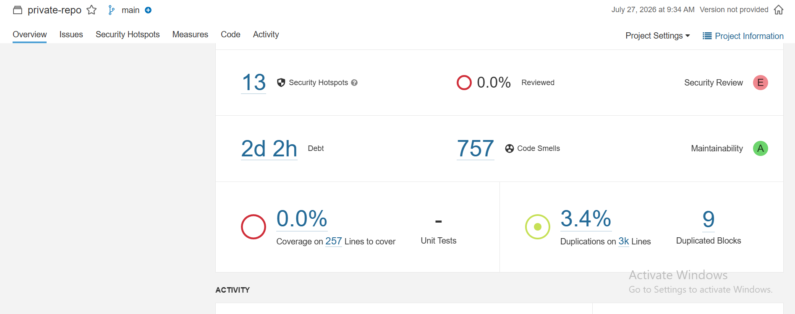
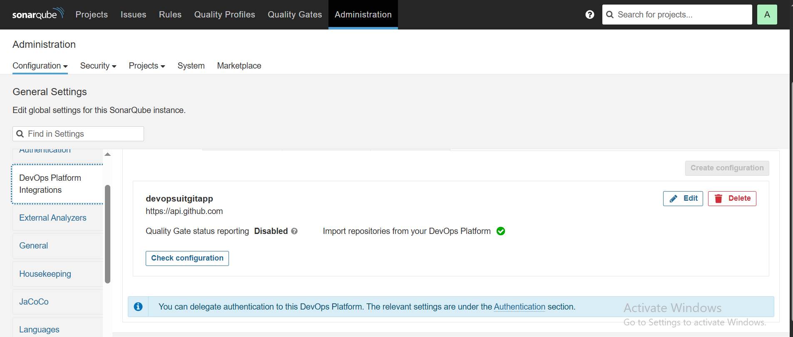
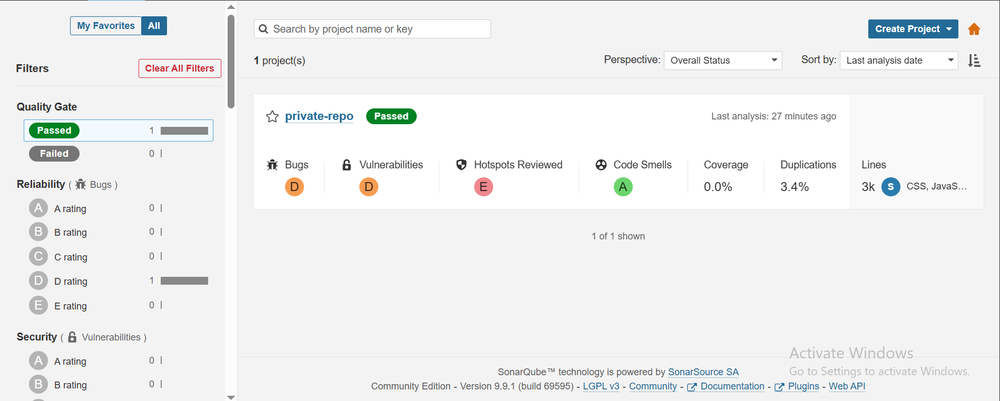
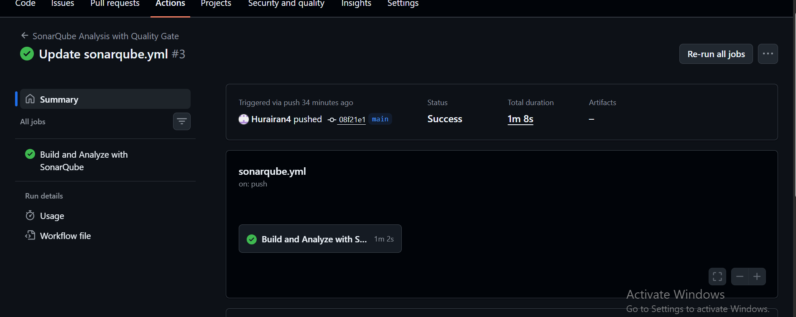
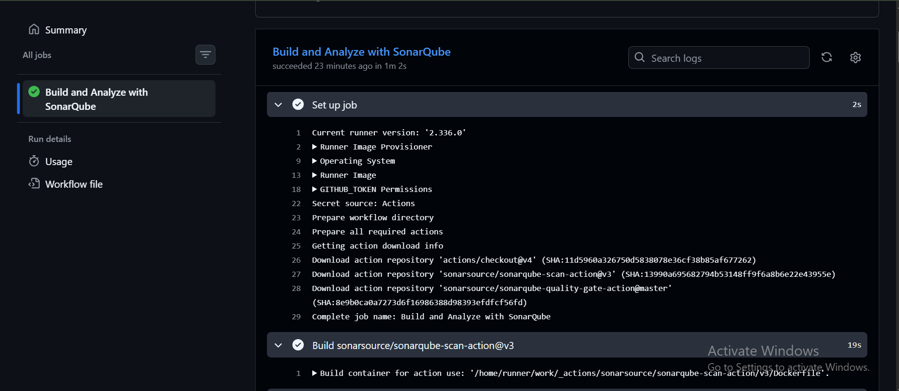
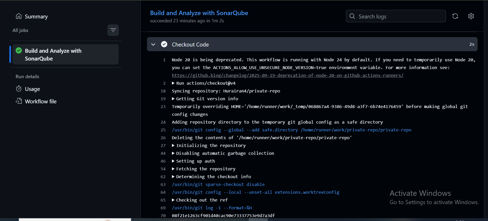

# SonarQube Code Quality & CI/CD on AWS


## Project Overview

This project demonstrates the deployment and configuration of SonarQube on an AWS EC2 Ubuntu server with PostgreSQL as its database backend.

The project focuses on integrating static code analysis into a DevOps workflow to identify code quality issues, bugs, vulnerabilities, code smells, and maintainability problems.

SonarQube was deployed on an AWS EC2 instance, connected to a PostgreSQL database, and configured as part of a code quality and CI/CD workflow.

---

## Objectives

* Deploy SonarQube on an AWS EC2 instance.
* Configure PostgreSQL as the SonarQube database.
* Configure SonarQube for code quality analysis.
* Analyze source code for bugs, vulnerabilities, and code smells.
* Integrate code quality analysis into a CI/CD workflow.
* Understand Quality Gates and static code analysis.
* Gain practical experience with DevOps tooling on AWS.

---

## Key Features

* SonarQube deployment on AWS EC2
* PostgreSQL database integration
* Static code analysis
* Bug detection
* Vulnerability detection
* Code smell detection
* Maintainability analysis
* Quality Gate evaluation
* CI/CD integration using GitHub Actions
* Linux systemd service management

---

## Technology Stack

| Category           | Technology       |
| ------------------ | ---------------- |
| Cloud Platform     | AWS EC2          |
| Operating System   | Ubuntu 24.04 LTS |
| Code Quality       | SonarQube        |
| Database           | PostgreSQL       |
| CI/CD              | GitHub Actions   |
| Version Control    | Git & GitHub     |
| Service Management | systemd          |

---

## Architecture

The following diagram illustrates the deployment and code analysis workflow.



---

## Workflow

```text
Developer
    │
    ▼
GitHub Repository
    │
    ▼
GitHub Actions
    │
    ▼
Code Analysis
    │
    ▼
SonarQube
    │
    ├── Bugs
    ├── Vulnerabilities
    ├── Code Smells
    └── Maintainability
    │
    ▼
Quality Gate
    │
    ▼
Analysis Result
```

---

## Project Components

### AWS EC2

An Ubuntu 24.04 EC2 instance hosts the SonarQube application and supporting services.

### SonarQube

SonarQube performs static code analysis and provides visibility into code quality, security, reliability, and maintainability.

### PostgreSQL

PostgreSQL is used as the persistent database backend for SonarQube.

### GitHub

GitHub is used for source code version control and repository management.

### GitHub Actions

GitHub Actions provides the CI/CD workflow used to automate code analysis.

---

## GitHub Repository

The project source code and configuration files are maintained in a GitHub repository.



### Repository Configuration

The repository configuration was prepared to support the CI/CD workflow and SonarQube integration.



---

## SonarQube Configuration & Analysis

### SonarQube Administration

SonarQube administration and project configuration were completed on the AWS-hosted SonarQube instance.



### SonarQube Analysis

The configured project was analyzed using SonarQube's static code analysis capabilities.



---

## CI/CD with GitHub Actions

GitHub Actions was configured to automate the code analysis workflow.

### GitHub Actions Configuration

The workflow configuration defines the automated process used for the project.



### GitHub Actions Workflow

The workflow executes the configured CI/CD process and performs the required analysis steps.



### Successful GitHub Actions Run

The completed workflow demonstrates that the configured CI/CD process executed successfully.



---

## Repository Structure

```text
sonarqube-code-quality-ci-cd-on-aws/
│
├── README.md
│
├── configs/
│   ├── sonar.properties.example
│   └── github-actions.yml
│
├── docs/
│   ├── installation.md
│   ├── configuration.md
│   └── troubleshooting.md
│
└── images/
    ├── architecture.png
    ├── github-actions-yml.png.PNG
    ├── github-repository.png.PNG
    ├── github-repository-configuration.png.PNG
    ├── sonarqube-administration.png.PNG
    ├── sonarqube-analysis.png.PNG
    ├── github-actions-success.png.PNG
    └── github-actions-workflow.png.PNG
```

---

## Documentation

Detailed documentation for the deployment and configuration is available in the `docs` directory.

| Document             | Description                                     |
| -------------------- | ----------------------------------------------- |
| `installation.md`    | SonarQube and PostgreSQL deployment             |
| `configuration.md`   | SonarQube, PostgreSQL and CI/CD configuration   |
| `troubleshooting.md` | Deployment and configuration issues encountered |

---

## Skills Demonstrated

* AWS EC2 Deployment
* Linux Administration
* PostgreSQL Configuration
* SonarQube Administration
* Static Code Analysis
* Code Quality Management
* Quality Gate Configuration
* Git & GitHub
* CI/CD Concepts
* GitHub Actions
* DevOps Troubleshooting

---

## Challenges Encountered

During the deployment and configuration process, practical issues were encountered involving:

* SonarQube service management
* PostgreSQL database configuration
* SonarQube database connectivity
* Java and SonarQube configuration
* Service startup and troubleshooting
* AWS EC2 resource management

These challenges provided practical experience in diagnosing and resolving issues in a real Linux-based DevOps environment.

---

## Future Improvements

* Automate EC2 infrastructure provisioning using Terraform.
* Automate SonarQube deployment using Ansible.
* Add Docker-based SonarQube deployment.
* Integrate SonarQube Quality Gates directly into pull requests.
* Add automated security and dependency scanning.
* Configure HTTPS using Nginx.

---

## License

This project is shared for educational and portfolio purposes.
